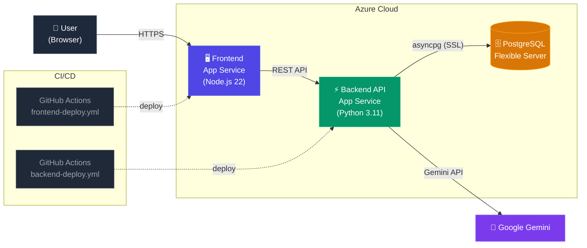

# 🎯 SkillGraph

**Upload your resume. Pick your dream role. See exactly what skills you're missing and how to learn them.**

SkillGraph is a cloud-native platform that analyzes real job market data, compares it against your resume, and generates a personalized visual skill graph with an actionable learning roadmap — powered by Google Gemini AI.

### 🌐 Live Demo

| Component | URL |
|---|---|
| **Frontend** | [skillgraph-app-web-h6g7h8cmbud8gtfd.centralindia-01.azurewebsites.net](https://skillgraph-app-web-h6g7h8cmbud8gtfd.centralindia-01.azurewebsites.net) |
| **Backend API** | [skillgraph-api-cjc3dzazd5bvb5a7.centralindia-01.azurewebsites.net](https://skillgraph-api-cjc3dzazd5bvb5a7.centralindia-01.azurewebsites.net) |

---

## ✨ Features

| Feature | Description |
|---|---|
| **Resume Upload & Parsing** | Drag-and-drop PDF/DOCX/TXT or Image (JPEG/PNG/WebP). Extracts text in-memory and parses images natively via Gemini — resume is **never stored**. |
| **AI Skill Extraction** | Google Gemini reads your resume and identifies your skills with proficiency levels. |
| **Job Market Analysis** | AI determines what skills your target role actually requires, based on real market data. |
| **Gap Analysis** | Compares your skills vs. role requirements. Shows readiness score (0–100%), matched & missing skills. |
| **Visual Skill Graph** | Clean Mermaid.js hierarchy graph. Green = you have it, red = you need it. |
| **AI Learning Roadmap** | Phased learning plan with time estimates and free resource links for every missing skill. |
| **35+ Roles Supported** | Works for any job — Software Engineer, Data Scientist, Marketing Manager, UX Designer, and more. |
| **Smart Caching** | Role skill requirements are cached in PostgreSQL. Repeat queries are instant. |
| **Anonymous Sessions** | No signup required. Session stored locally in your browser. |
| **Responsive Design** | Works on mobile, tablet, and desktop. |

---

## 🛠️ Tech Stack

### Frontend
- **Next.js 16** (App Router, TypeScript, Standalone output)
- **Tailwind CSS v4** — styling
- **Mermaid.js** — automatic visual skill graph generation
- **React 19** — UI framework

### Backend
- **Python 3.11+ / FastAPI** — REST API
- **Google Gemini** (`gemini-2.5-flash-lite`) — AI skill extraction, image vision processing, & roadmap generation
- **Instructor** — structured LLM output with Pydantic validation
- **PyMuPDF & python-docx** — PDF/DOCX text extraction
- **asyncpg** — async PostgreSQL driver
- **Gunicorn + Uvicorn** — production ASGI server

### Infrastructure
- **Azure App Service (Python 3.11)** — Backend API
- **Azure App Service (Node.js 22)** — Frontend (standalone mode)
- **Azure Database for PostgreSQL** — sessions, caching, results
- **GitHub Actions** — CI/CD auto-deploy on push to `main`

---

## 📁 Project Structure

```
skillgraph/
├── backend/
│   ├── app/
│   │   ├── main.py              # FastAPI app, routes, CORS, lifespan
│   │   ├── config.py            # Settings from environment variables
│   │   ├── models.py            # Pydantic data models
│   │   ├── db.py                # PostgreSQL connection pool & queries
│   │   └── services/
│   │       ├── resume_parser.py # PDF/DOCX/TXT → plain text
│   │       ├── ai_service.py    # Google Gemini API calls
│   │       └── gap_analyzer.py  # Skill comparison logic
│   └── requirements.txt
│
├── frontend/
│   ├── src/
│   │   ├── app/                 # Next.js pages (landing + results)
│   │   ├── components/
│   │   │   ├── GapSummary.tsx   # Gap analysis visualization
│   │   │   ├── ResumeUpload.tsx # Drag-and-drop file upload
│   │   │   ├── Roadmap.tsx      # Learning roadmap display
│   │   │   ├── RoleSelector.tsx # Target role dropdown
│   │   │   └── SkillGraph.tsx   # Mermaid.js visualization component
│   │   └── lib/                 # API client, types, utilities
│   ├── next.config.ts
│   └── package.json
│
├── .github/workflows/
│   ├── backend-deploy.yml       # CI/CD: Backend → Azure
│   └── frontend-deploy.yml      # CI/CD: Frontend → Azure
│
├── docker-compose.yml           # Local dev PostgreSQL
└── README.md
```

---

## ☁️ Architecture



---

## 🔌 API Endpoints

| Method | Endpoint | Description |
|---|---|---|
| `GET` | `/health` | Health check → `{"status":"ok"}` |
| `GET` | `/api/roles` | List all 35+ supported roles |
| `POST` | `/api/analyze` | Upload resume + target role → full analysis |
| `GET` | `/api/roles/{name}/skills` | Get cached skill requirements for a role |
| `GET` | `/api/session/{id}/history` | Get past analyses for a session |
| `GET` | `/api/analysis/{id}` | Get a full analysis result by ID |

---

## ⚙️ Environment Variables

### Backend (Azure App Service)

| Variable | Required | Description |
|---|---|---|
| `GEMINI_API_KEY` | ✅ | Google Gemini API key |
| `DATABASE_URL` | ✅ | PostgreSQL connection string (`?sslmode=require`) |
| `ALLOWED_ORIGINS` | ✅ | Frontend URL (CORS) |
| `GEMINI_MODEL` | ❌ | Model name (default: `gemini-2.0-flash`) |
| `SCM_DO_BUILD_DURING_DEPLOYMENT` | ✅ | Set to `1` for Azure to install dependencies |

### Frontend (GitHub Actions Secret)

| Variable | Required | Description |
|---|---|---|
| `NEXT_PUBLIC_API_URL` | ✅ | Backend API URL (baked in at build time) |

---

## 🔒 Privacy

- **Resumes are never stored.** Processed entirely in-memory and discarded after skill extraction.
- **No login required.** Anonymous sessions via UUID stored in your browser's localStorage.
- **Session data auto-expires** after 30 days of inactivity.


