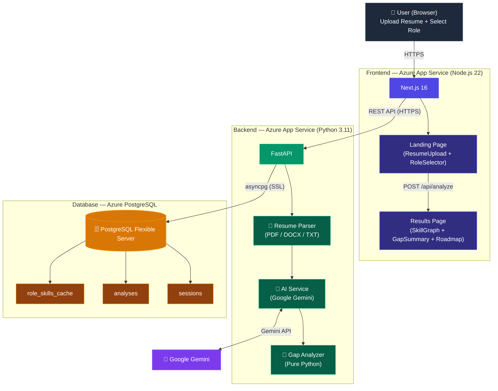
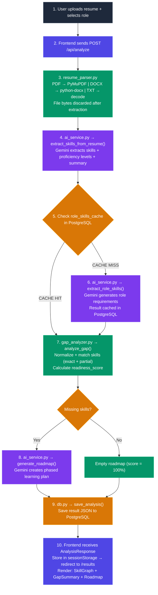
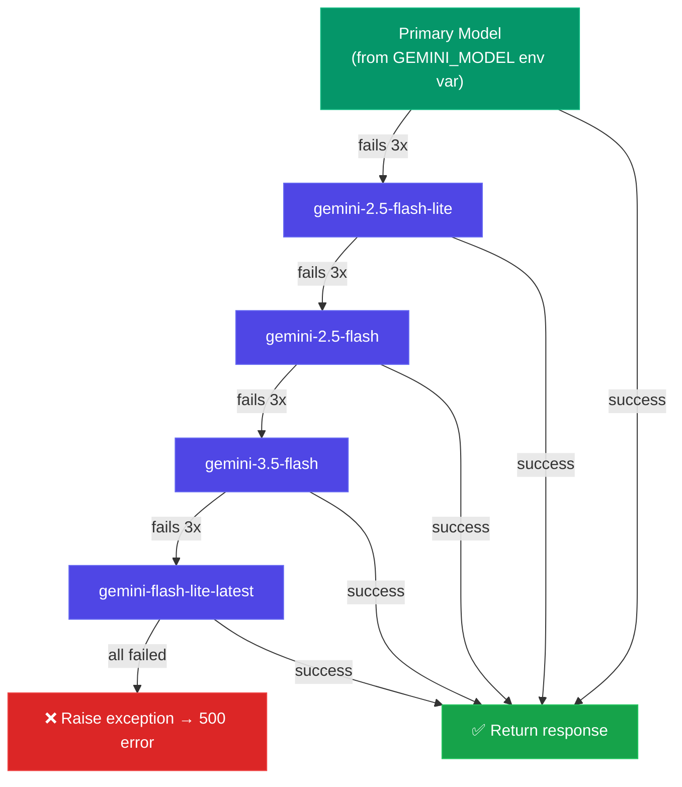
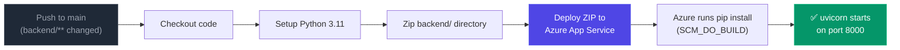
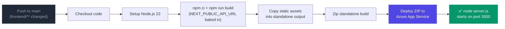

# SkillGraph — Architecture Documentation

## System Overview

SkillGraph is a three-tier cloud-native application deployed on Microsoft Azure. It accepts a user's resume and a target job role, then uses Google Gemini AI to perform skill extraction, gap analysis, and personalized learning roadmap generation.



---

## Data Flow

### Full Analysis Pipeline



### Gemini API Calls Per Analysis

| Call | Function | Cacheable? | Temperature |
|---|---|---|---|
| 1 | `extract_skills_from_resume()` | No (unique per resume) | 0.2 |
| 2 | `extract_role_skills()` | Yes (cached in PostgreSQL) | 0.3 |
| 3 | `generate_roadmap()` | No (depends on gap result) | 0.4 |

---

## Backend Architecture

### Module Breakdown

| Module | Responsibility |
|---|---|
| `main.py` | FastAPI app, route definitions, CORS middleware, lifespan events |
| `config.py` | Environment variable loading via `python-dotenv`, validation |
| `models.py` | All Pydantic schemas (request/response models, AI output schemas) |
| `db.py` | asyncpg connection pool, table creation, all SQL queries |
| `services/resume_parser.py` | PDF/DOCX/TXT → plain text extraction (in-memory only) |
| `services/ai_service.py` | Google Gemini API calls with retry logic and model fallback |
| `services/gap_analyzer.py` | Skill matching algorithm (pure Python, no AI) |

### AI Service Resilience

The `ai_service.py` module includes a robust retry and fallback mechanism:



- **Transient errors** (503, 429 rate limit): retried with exponential backoff
- **Hard errors** (invalid key, model not found): immediately moves to next model
- **All models exhausted**: returns 500 to the user

### Gap Analyzer Algorithm

```python
For each required skill in the role:
  1. Normalize the skill name (lowercase, strip punctuation/spaces)
  2. Look up in user's skill set (exact match)
  3. If no exact match → try partial matching (substring containment)
  4. If match found → add to matched_skills
  5. If no match → add to missing_skills

readiness_score = len(matched) / len(total_required)
```

---

## Frontend Architecture

### Page Structure

| Route | Component | Purpose |
|---|---|---|
| `/` | `page.tsx` (LandingPage) | Resume upload form + role selector |
| `/results` | `results/page.tsx` | Analysis results dashboard |

### Component Breakdown

| Component | Purpose |
|---|---|
| `ResumeUpload.tsx` | Drag-and-drop file upload with validation (PDF/DOCX/TXT) |
| `RoleSelector.tsx` | Searchable dropdown populated from `GET /api/roles` |
| `SkillGraph.tsx` | Interactive React Flow node graph (green = matched, red = missing) |
| `GapSummary.tsx` | Readiness score visualization, matched vs. missing counts |
| `Roadmap.tsx` | Phased learning plan with time estimates and resource links |

### State Management

- **No global state library** — uses React `useState` + `sessionStorage`
- Analysis result is stored in `sessionStorage` after API response
- Results page reads from `sessionStorage` on mount
- Anonymous session ID is persisted in `localStorage`

### API Client (`lib/api.ts`)

```
API_BASE = NEXT_PUBLIC_API_URL || "http://localhost:8000"
```

- `NEXT_PUBLIC_API_URL` is baked in at build time (Next.js requirement)
- Session ID is sent via `X-Session-ID` header on subsequent requests

---

## Database Schema

### Tables

```sql
-- Anonymous user sessions
CREATE TABLE sessions (
    id              UUID PRIMARY KEY,
    created_at      TIMESTAMPTZ NOT NULL DEFAULT NOW(),
    last_active_at  TIMESTAMPTZ NOT NULL DEFAULT NOW()
);

-- Saved analysis results
CREATE TABLE analyses (
    id              UUID PRIMARY KEY DEFAULT gen_random_uuid(),
    session_id      UUID REFERENCES sessions(id) ON DELETE CASCADE,
    target_role     TEXT NOT NULL,
    readiness_score REAL NOT NULL,
    result_json     JSONB NOT NULL,
    created_at      TIMESTAMPTZ NOT NULL DEFAULT NOW()
);

-- Cached role skill requirements (avoids repeat Gemini calls)
CREATE TABLE role_skills_cache (
    role_name   TEXT PRIMARY KEY,       -- normalized (lowercase, trimmed)
    skills_json JSONB NOT NULL,
    updated_at  TIMESTAMPTZ NOT NULL DEFAULT NOW()
);
```

### Table Auto-Creation

Tables are created automatically on application startup via the `init_db()` function called in FastAPI's lifespan context manager. No manual migration is needed.

---

## CI/CD Pipeline

### GitHub Actions Workflows

#### Backend (`backend-deploy.yml`)



#### Frontend (`frontend-deploy.yml`)



### Required GitHub Secrets

| Secret | Used By | Description |
|---|---|---|
| `AZURE_WEBAPP_PUBLISH_PROFILE` | Backend workflow | Backend App Service publish profile XML |
| `AZURE_WEBAPP_FRONTEND_PUBLISH_PROFILE` | Frontend workflow | Frontend App Service publish profile XML |
| `NEXT_PUBLIC_API_URL` | Frontend workflow | Backend API URL (baked into JS at build time) |

---

## Security Considerations

| Concern | Mitigation |
|---|---|
| Resume privacy | File bytes processed in-memory only; explicitly deleted after text extraction |
| CORS | `ALLOWED_ORIGINS` restricts API access to the frontend domain only |
| SQL Injection | All queries use parameterized statements via asyncpg |
| API Key exposure | `GEMINI_API_KEY` stored in Azure App Settings (encrypted at rest) |
| Database connection | SSL enforced via `?sslmode=require` in connection string |
| Authentication | Anonymous sessions via UUID — no PII collected |
